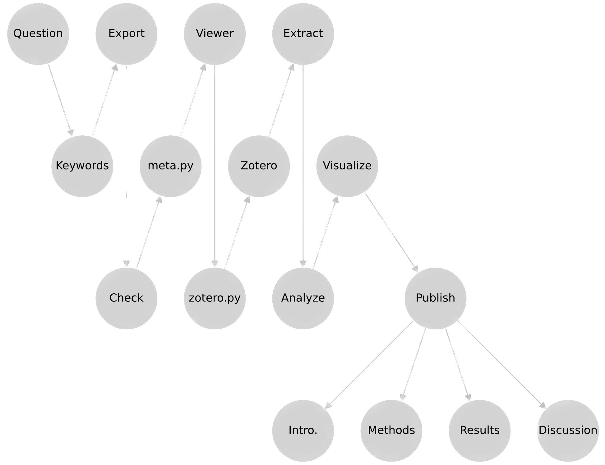

## Description

**meta** is a comprehensive meta-analysis pipeline designed to facilitate insightful research by integrating data across diverse fields. This tool empowers researchers to uncover hidden insights and trends that individual studies might overlook.

## Getting Started

1. Clone the repository:
   ```bash
   git clone https://github.com/abikahs/meta.git
   ```
2. Navigate to the project directory:
   ```bash
   cd meta
   ```
3. Install dependencies:
   ```bash
   pip install -r requirements.txt
   ```
4. Follow the pipeline's flowchart to proceed with the analysis.

## Usage
<p>
  
</p>

## Contact Information

If you have any questions, feedback, or need assistance, feel free to reach out:

- **Email:** [-@data-meta.info](mailto:contact@data-meta.info)
- **GitHub:** [github.com/abikahs/meta](https://github.com/abikahs/meta)

---

*This project is brought to you by [data-meta.info](data-meta.info)*

